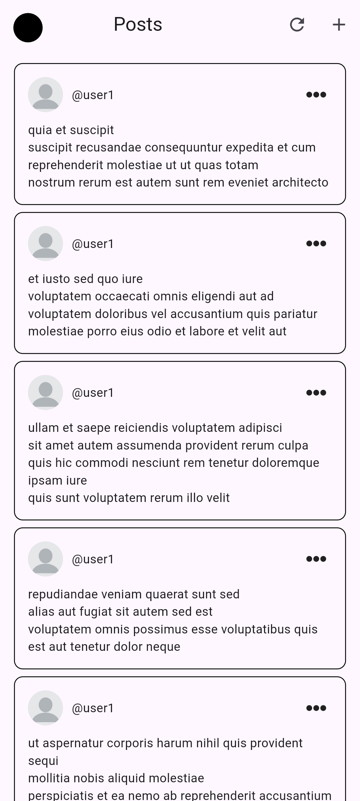

# MAD 3 Tasks

### 1. See all posts
### 2. Show a summary card instead  of all the data (GET /posts)
### 3. See the details of a specific post
### 4. Show a detailed view via modal or a different screen (GET /posts/id)
### 5. Add a new post and see it in the overall list (POST /posts) 
### 6. Delete a post (resource will not be really updated on the server but it will be faked as if) therefore find a way to make it seem as if it was added in the UI
### 7. Edit a post (PUT) (resource will not be really updated on the server but it will be faked as if) therefore find a way to make it seem as if it was added in the UI
### 8. Delete a post (resource will not be really updated on the server but it will be faked as if) therefore find a way to make it seem as if it was deleted in the UI
### 9. Ensure aesthetics and validation for inputs.

#### All tasks done by Catado

