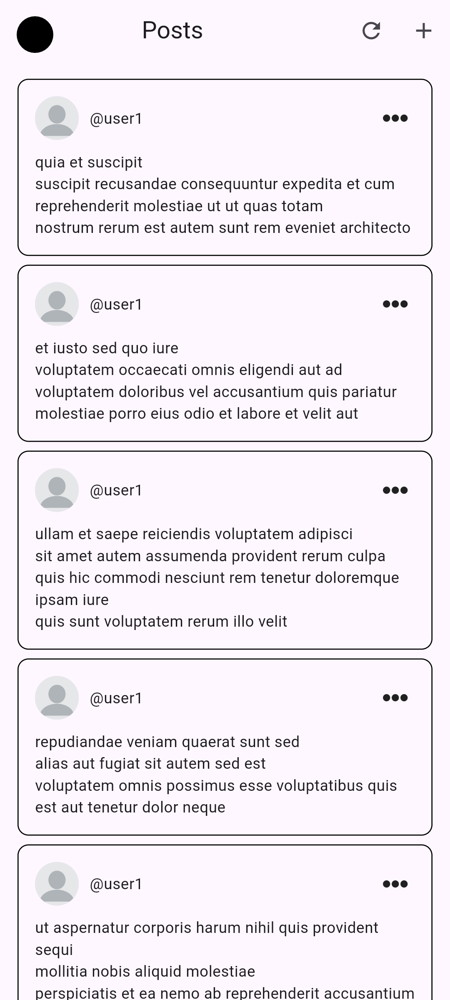
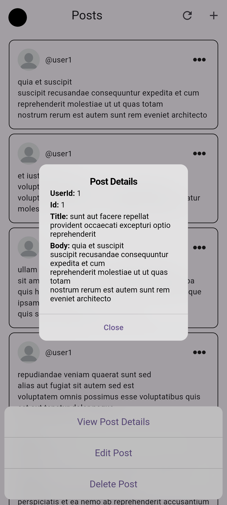
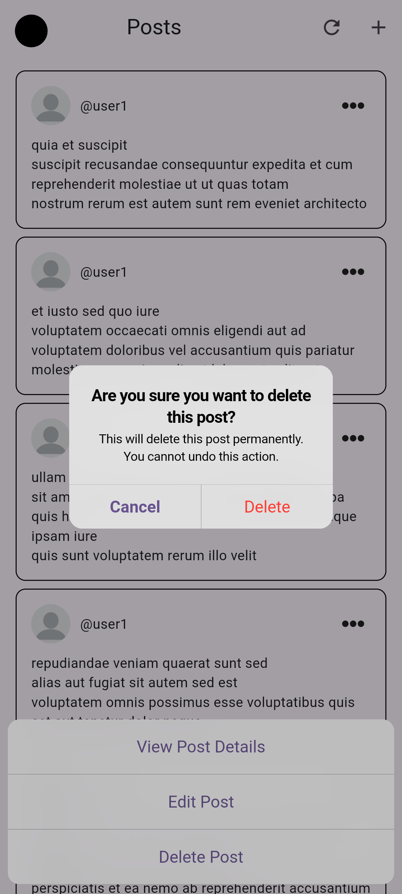
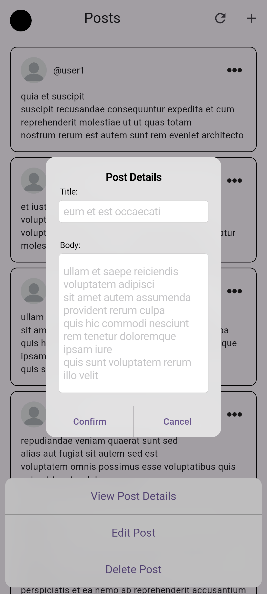
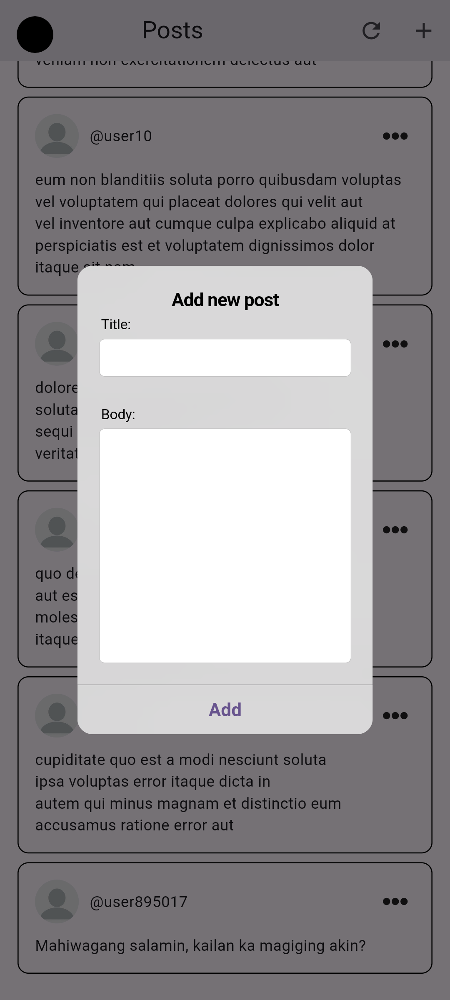

# MAD 3 Tasks

## Table of Contents
- [See all posts](#see-all-posts)
- [Show a summary card instead of all the data (GET /posts)](#show-a-summary-card-instead-of-all-the-data-get-posts)
- [See the details of a specific post](#see-the-details-of-a-specific-post)
- [Show a detailed view via modal or a different screen (GET /posts/id)](#show-a-detailed-view-via-modal-or-a-different-screen-get-posts-id)
- [Add a new post and see it in the overall list (POST /posts)](#add-a-new-post-and-see-it-in-the-overall-list-post-posts)
- [Delete a post (faked deletion in UI)](#delete-a-post-faked-deletion-in-ui)
- [Edit a post (PUT) (faked update in UI)](#edit-a-post-put-faked-update-in-ui)
- [Ensure aesthetics and validation for inputs](#ensure-aesthetics-and-validation-for-inputs)

## Output Screenshots

### List of all posts

### Show Post Details

### Delete Post

### Edit Post

### Add Post

## All tasks done by Catado

